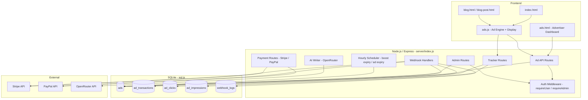
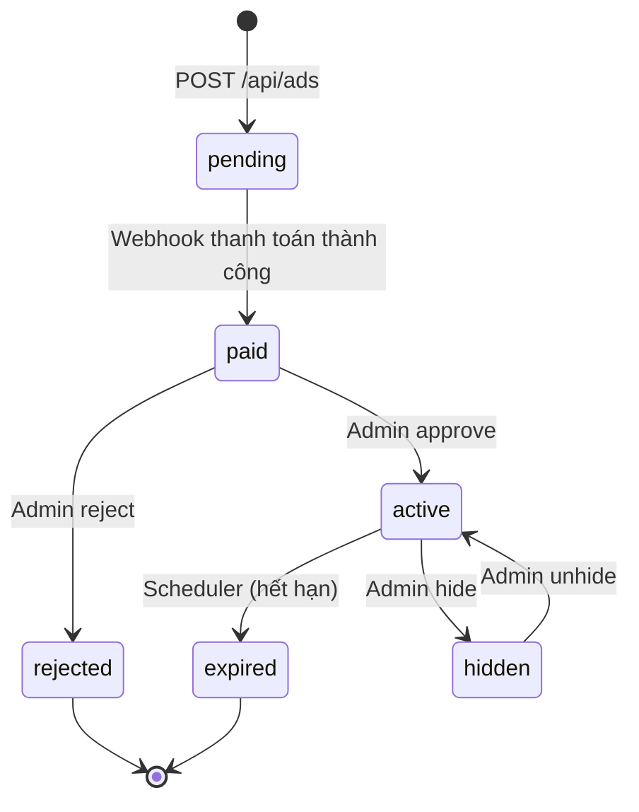

# Design Document: Ad Marketplace

## Overview

Ad Marketplace là hệ thống cho thuê đặt link quảng cáo tích hợp vào portfolio website hiện có. Người dùng (Advertiser) đăng sản phẩm Shopee / TikTok Shop / affiliate, thanh toán qua Stripe hoặc PayPal, và quảng cáo được hiển thị tại các slot cố định trên website. Admin duyệt quảng cáo, quản lý doanh thu. AI hỗ trợ viết mô tả. Tracker đếm click và impression theo thời gian thực.

Hệ thống được xây dựng hoàn toàn trên nền tảng hiện có:
- Backend: Node.js + Express (`server/index.js`)
- Database: SQLite qua `sql.js` (`server/db.js`) với helpers `run()`, `all()`, `get()`
- Auth: JWT 30 ngày, `requireUser` middleware, `requireAdmin` middleware (`x-admin-token` header)
- Frontend: Vanilla JS + HTML tĩnh
- Deploy: Render.com

---

## Architecture



### Luồng chính

1. **Advertiser đăng ad**: `POST /api/ads` → status `pending`
2. **Thanh toán**: `POST /api/ads/:id/pay/stripe` → Stripe Checkout → webhook → status `paid`
3. **Admin duyệt**: `PATCH /api/admin/ads/:id` → status `active`, bắt đầu đếm ngày
4. **Hiển thị**: Frontend gọi `GET /api/ads/slots/:slot` → inject vào DOM
5. **Tracking**: Click/impression → `POST /api/ads/track/click/:id` hoặc `impression/:id`
6. **Hết hạn**: Scheduler chạy mỗi giờ → set `expired` / reset `boost_score`

---

## Components and Interfaces

### Backend Components

#### Ad API (`/api/ads`)

| Method | Path | Auth | Mô tả |
|--------|------|------|-------|
| POST | `/api/ads` | requireUser | Tạo ad mới, status = pending |
| GET | `/api/ads/my` | requireUser | Lấy danh sách ads của user |
| GET | `/api/ads/slots/:slot` | public | Lấy ads active theo slot |
| GET | `/api/ads/:id/stats` | requireUser | Stats click/impression/CTR |
| POST | `/api/ads/:id/ai-description` | requireUser | AI viết mô tả |
| POST | `/api/ads/:id/pay/stripe` | requireUser | Tạo Stripe Checkout session |
| POST | `/api/ads/:id/pay/paypal` | requireUser | Tạo PayPal order |
| POST | `/api/ads/track/click/:id` | public | Track click event |
| POST | `/api/ads/track/impression/:id` | public | Track impression event |

#### Admin API (`/api/admin/ads`)

| Method | Path | Auth | Mô tả |
|--------|------|------|-------|
| GET | `/api/admin/ads` | requireAdmin | List tất cả ads, filter theo status |
| PATCH | `/api/admin/ads/:id` | requireAdmin | Approve / reject / hide / edit |
| DELETE | `/api/admin/ads/:id` | requireAdmin | Xóa vĩnh viễn |
| GET | `/api/admin/ads/revenue` | requireAdmin | Revenue stats + top advertisers |

#### Webhook Handlers

| Method | Path | Auth | Mô tả |
|--------|------|------|-------|
| POST | `/api/webhooks/stripe` | Stripe signature | Xử lý `checkout.session.completed` |
| POST | `/api/webhooks/paypal` | PayPal signature | Xử lý `PAYMENT.CAPTURE.COMPLETED` |

#### AI Writer

- Gọi OpenRouter API với model mặc định (ví dụ `mistralai/mistral-7b-instruct`)
- Prompt: viết mô tả tiếng Việt 50–150 từ cho sản phẩm `{product_name}` trên `{platform}`
- Fallback: template tĩnh nếu OpenRouter không phản hồi trong 2 giây
- Rate limit: 10 lượt/user/ngày, lưu vào bảng `user_usage` (tool = `ad_ai_description`)

#### Scheduler

- Chạy `setInterval` mỗi 3600 giây (1 giờ) sau khi server khởi động
- Job 1: `UPDATE ads SET status='expired' WHERE status='active' AND expires_at < datetime('now')`
- Job 2: `UPDATE ads SET boost_score=0 WHERE boost_score > 0 AND boost_expires_at < datetime('now')`

### Frontend Components

#### `ads.html` — Advertiser Dashboard

- Form đăng ad: product_name, link, image_url, price, description, platform, plan
- Nút "AI viết mô tả" → gọi `/api/ads/:id/ai-description`
- Bảng danh sách ads: status, slot, clicks, impressions, CTR, ngày còn lại
- Bảng lịch sử thanh toán
- Chart daily clicks/impressions (Chart.js hoặc canvas thuần)

#### `ads.js` — Ad Display Engine

- Hàm `loadAdSlot(slot, containerId)`: gọi `GET /api/ads/slots/:slot`, render HTML vào container
- Inject vào `index.html`: `banner_header`, `banner_sidebar`
- Inject vào `blog.html`: `banner_sidebar`, `banner_mid_article`
- Inject vào `blog-post.html`: `top_vip`, `pinned_post`, `banner_mid_article`
- Intersection Observer: khi ad vào viewport ≥ 50% → gọi track impression
- Click handler: gọi track click trước khi redirect

#### `ads.css` — Styles

- `.ad-card`: card cơ bản cho ad
- `.ad-card.vip`: border vàng, badge "VIP"
- `.ad-banner`: banner ngang/dọc
- `.ad-slot-top-vip`: container nổi bật đầu trang

---

## Data Models

### Bảng `ads`

```sql
CREATE TABLE IF NOT EXISTS ads (
    id INTEGER PRIMARY KEY AUTOINCREMENT,
    user_id INTEGER NOT NULL,
    product_name TEXT NOT NULL,           -- max 200 chars
    link TEXT NOT NULL,                   -- URL Shopee/TikTok/affiliate
    image_url TEXT DEFAULT '',            -- HTTPS URL hoặc rỗng
    price INTEGER NOT NULL DEFAULT 0,     -- VND, integer >= 0
    description TEXT DEFAULT '',          -- max 1000 chars
    platform TEXT NOT NULL DEFAULT 'shopee', -- shopee | tiktok | affiliate
    slot TEXT NOT NULL DEFAULT 'banner_sidebar', -- top_vip | pinned_post | banner_header | banner_sidebar | banner_mid_article
    status TEXT NOT NULL DEFAULT 'pending',      -- pending | paid | active | expired | rejected | hidden
    boost_score INTEGER NOT NULL DEFAULT 0,
    boost_expires_at DATETIME DEFAULT NULL,
    display_days INTEGER NOT NULL DEFAULT 7,
    activated_at DATETIME DEFAULT NULL,
    expires_at DATETIME DEFAULT NULL,
    rejection_reason TEXT DEFAULT '',
    created_at DATETIME DEFAULT (datetime('now'))
);
```

### Bảng `ad_transactions`

```sql
CREATE TABLE IF NOT EXISTS ad_transactions (
    id INTEGER PRIMARY KEY AUTOINCREMENT,
    ad_id INTEGER NOT NULL,
    user_id INTEGER NOT NULL,
    plan TEXT NOT NULL DEFAULT 'standard',   -- standard | premium | vip_boost
    amount INTEGER NOT NULL,                 -- VND
    currency TEXT NOT NULL DEFAULT 'VND',
    payment_method TEXT NOT NULL,            -- stripe | paypal
    payment_id TEXT DEFAULT '',              -- Stripe session ID hoặc PayPal order ID
    status TEXT NOT NULL DEFAULT 'pending',  -- pending | paid | failed
    created_at DATETIME DEFAULT (datetime('now'))
);
```

### Bảng `ad_clicks`

```sql
CREATE TABLE IF NOT EXISTS ad_clicks (
    id INTEGER PRIMARY KEY AUTOINCREMENT,
    ad_id INTEGER NOT NULL,
    referrer_page TEXT DEFAULT '',
    ip_hash TEXT DEFAULT '',   -- SHA-256 của IP, không lưu IP thô
    created_at DATETIME DEFAULT (datetime('now'))
);
```

### Bảng `ad_impressions`

```sql
CREATE TABLE IF NOT EXISTS ad_impressions (
    id INTEGER PRIMARY KEY AUTOINCREMENT,
    ad_id INTEGER NOT NULL,
    session_id TEXT DEFAULT '',  -- random session token từ frontend
    created_at DATETIME DEFAULT (datetime('now'))
);
```

### Bảng `webhook_logs`

```sql
CREATE TABLE IF NOT EXISTS webhook_logs (
    id INTEGER PRIMARY KEY AUTOINCREMENT,
    provider TEXT NOT NULL,       -- stripe | paypal
    event_type TEXT NOT NULL,
    payload TEXT NOT NULL,        -- JSON string
    status TEXT NOT NULL DEFAULT 'received',  -- received | processed | failed
    created_at DATETIME DEFAULT (datetime('now'))
);
```

### Pricing Tiers

| Plan | Giá (VND) | Số ngày | Slot | boost_score |
|------|-----------|---------|------|-------------|
| standard | 50,000 | 7 | banner_sidebar | 0 |
| premium | 150,000 | 30 | banner_header + banner_sidebar | 0 |
| vip_boost | 300,000 | 7 | top_vip | 100 |

### Ad Status Flow



---

## Correctness Properties

*A property is a characteristic or behavior that should hold true across all valid executions of a system — essentially, a formal statement about what the system should do. Properties serve as the bridge between human-readable specifications and machine-verifiable correctness guarantees.*

